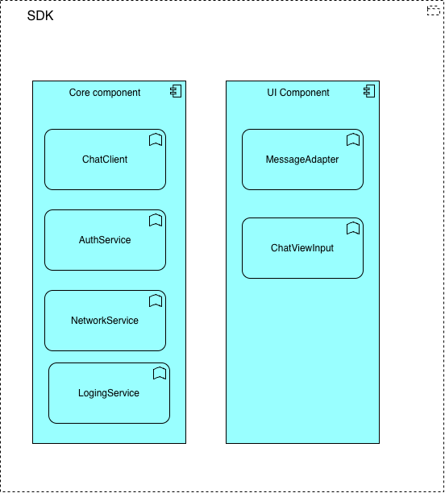

**Требования к SDK**

- Поддержка Android/IOS (Отдельный package, который можно подключить к новым проектам)
- Поддержка WEB (Встраиваемый js скрипт)
- Для инициализации чата необходима авторизация (завязываемся на playedId)
- Возможность кастомизация UI чата (UI)
- Поддержка эмоджи

**Архитектура SDK**

**Описание компонентов**

***Core component***

- ChatClient 
   - Инициализация чата
   - Конфигурация
   - Управление жизненным циклом чата (init/start/stop/destroy)
   - Координация работы всех сервисов
   - Бизнес логика подключения/отключения к комнате

- AuthService 
   - Получение токена для инициализации сессии чата (Используется в ChatClient)
   - Кэширование токена (TTL задается в конфигурации)
   - Управление токенами

- NetworkService
   - Описание конфигураций подключения к Backend
   - Управление WebSocket подключениями
   - Обработка ошибок и retray
   - Безопасность и шифрование данных

- LoggingService
  - Логирование событий отправки сообщений
  - Фильтрация по уровням (DEBUG, INFO, WARN, ERROR)
  - Контекстное логирование (userId, roomId, messageId)
  - Экспорт логов для диагностики 

***UI component***
- MessageAdapter
  - Стилизация сообщений
  - Поддержка эмоджи
  - Анимация сообщений

- ChatViewInput
  - Стилизация UI чата